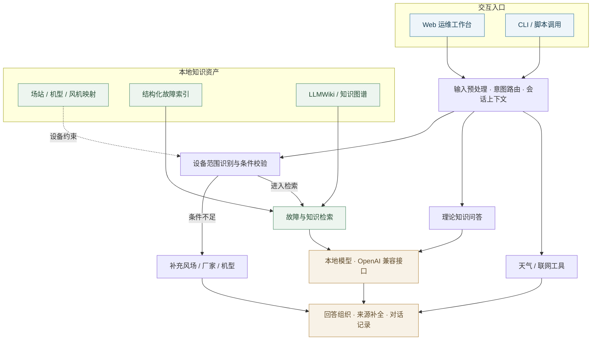

<p align="center">
  
</p>

<h1 align="center">Windrise · 风电运维智能助手</h1>

<p align="center">
  连接设备、知识与现场判断。<br />
  将故障手册、场站资产与本地大模型整合为可追溯的运维问答工作台。
</p>

<p align="center">
  <a href="#workspace">产品界面</a> ·
  <a href="#innovation">创新与优势</a> ·
  <a href="#capabilities">核心能力</a> ·
  <a href="#architecture">技术架构</a> ·
  <a href="#deployment">部署运行</a> ·
  <a href="#documentation">文档中心</a>
</p>

<p align="center">
  
  
  
  
</p>

---

<table>
  <tr>
    <td align="center" width="25%"><h3>14,118</h3>结构化故障记录</td>
    <td align="center" width="25%"><h3>12</h3>设备品牌</td>
    <td align="center" width="25%"><h3>28</h3>场站机型配置</td>
    <td align="center" width="25%"><h3>1,265</h3>风机编号映射</td>
  </tr>
</table>

<p align="center"><sub>按当前仓库数据统计。配置与映射为记录条数，不代表独立风场数或覆盖率。</sub></p>

<a id="workspace"></a>

## 从现场问题，到有据可查的回答

同一个报警码，可能对应不同厂家的不同故障；同一座风场，也可能运行多种机型。Windrise 将设备范围识别、资料检索和回答组织串联起来，帮助运行、检修与集控人员找到适用于当前机组的依据。

<p align="center">
  
</p>

<p align="center"><sub>实际运行截图，已裁去部署环境的品牌页眉，保留回答来源、设备字段与资源监控。</sub></p>

| 现场输入 | 系统处理 | 回答依据 |
| :--- | :--- | :--- |
| 完整报警码 | 匹配故障索引，保留厂家与机型范围 | 故障条目与来源位置 |
| 风场名称、风机编号 | 查询资产映射，补全设备上下文 | 场站、品牌与型号记录 |
| 故障现象、处理追问 | 检查条件完整性，结合上下文检索 | 本地手册与相关知识页 |
| 设备原理、通用知识 | 进入理论问答路径 | 模型通用知识，与现场资料检索区分 |

<a id="innovation"></a>

## 创新点与项目优势

**Windrise 的核心创新，是面向多厂家、多机型的风电运维场景，将设备身份、故障语义、会话状态与资料依据共同纳入问答流程。** 项目的差异化主要体现在领域方法和工程实现：通过可追溯的处理链路，支持从现场描述到适用资料的定位与回答组织。

### 六项领域创新

| 创新方向 | 具体实现 | 解决的问题 |
| :--- | :--- | :--- |
| **设备范围约束检索** | 将场站、厂家、机型、标准型号和风机编号作为检索条件；对多机型场站与同码多义情况进行范围收敛、条件澄清或候选分组 | 语义相似的资料可能属于另一种设备，处理建议需要先确认适用对象 |
| **工业标识语义消歧** | 区分报警码、风机编号、机型数字、测量值、容量和叶片轴号，并处理故障码的空格、下划线等表示差异 | 避免将机型中的数字、温度值或叶片编号误识别为故障码，导致检索偏离 |
| **面向任务的多轮状态管理** | 区分信息补充、用户纠正、同一故障追问和新故障；结合当前输入更新设备与故障字段，并提供话题切换处理 | 适应现场逐步补充信息的表达方式，减少旧机组、旧故障信息对新问题的干扰 |
| **确定性查询与模型协同** | 为设备映射、明确故障查询、理论解释和资料问答设计不同路径；支持直接从结构化记录组织答案 | 对可直接查证的事实采用明确查询路径，使模型调用更贴合实际任务 |
| **设备映射与故障证据交叉核验** | 在相应故障路径中检查记录与场站、机号、品牌的匹配及来源是否存在，记录核验信息，并展示对象、故障、处理字段和来源 | 为使用者回查资料、开发者定位错误提供依据；核验对象是记录一致性，不代表现场诊断已确认 |
| **知识构建与运行解耦** | 将原始资料构建为故障索引、资产映射和 Wiki，配套知识重载、故障码审计与上下文评测脚本 | 让资料更新、索引维护和回归验证形成可重复的工作流程，降低知识维护对模型训练的依赖 |

### 四项应用优势

- **更贴近现场提问方式。** 支持从报警码、设备编号或现象描述开始，再逐步补充厂家、机型与场站，便于运行人员在信息尚不完整时展开查询。
- **回答更便于核对。** 将适用设备、故障条目和来源位置放在同一回答中，帮助检修人员判断资料是否适用于当前对象，也方便交接班与问题复盘。
- **部署与模型选择更灵活。** 通过 OpenAI 兼容接口接入本地模型，提供 Ubuntu 源码、Portable 和离线迁移方案，便于按内网条件与算力资源部署。
- **知识资产可以持续维护。** 当前已组织 14,118 条故障记录、12 个品牌、28 条场站机型配置和 1,265 条风机映射；可通过资料更新与索引重建扩充知识，Web 与 CLI 分别服务人工操作和脚本集成。

<details>
<summary><strong>实现依据与验证范围</strong></summary>

| 能力 | 代码或验证入口 |
| :--- | :--- |
| 条件澄清、故障切换与多轮字段更新 | [轻量问答路由](scripts/windrise-chat.mjs)：`classifyTurnIntent`、`resolveFaultRouting` |
| 工业数字与编号消歧 | [Web 服务](hn/dify_web_server_.py)：`extract_fault_codes`、`is_measurement_numeric_fragment`、`is_pitch_blade_axis_token` |
| 设备范围过滤与证据追踪 | [Web 服务](hn/dify_web_server_.py)：`collect_scoped_fault_index_candidates`、`cross_verify_fault_record`、`build_windrise_evidence_trace` |
| 资料结构化与知识更新 | [故障索引构建](scripts/build-fault-index.mjs)、[知识重载](scripts/reload-wind-knowledge.sh) |
| 检索、上下文与同码多义检查 | [评测脚本定义](package.json)、[历史报告](reports/) |

上述创新指 Windrise 的领域适配与系统设计，不将通用大模型、RAG、MCP 或底层智能体已有能力作为原创算法。已有 200 问报告记录了特定检索与上下文用例的通过情况，且测试时模型服务不可访问；这些结果不能外推为端到端诊断准确率、生产并发能力或现场处置效果。本节未宣称未经对照实验验证的效率提升比例。

</details>

<a id="capabilities"></a>

## 围绕运维工作组织能力

<table>
  <tr>
    <td valign="top" width="50%">
      <h3>01 / 设备范围识别</h3>
      <p>通过风场、厂家、机型与风机编号约束检索范围。面对同码多义或多机型场站，保留候选差异，并提示补充条件。</p>
      <sub>资产映射 · 条件补全 · 故障码消歧</sub>
    </td>
    <td valign="top" width="50%">
      <h3>02 / 知识来源追溯</h3>
      <p>将故障码资料、Markdown 手册与表格整理为结构化索引和 LLMWiki，为回答提供可回查的来源文件与位置。</p>
      <sub>故障索引 · Wiki 检索 · 来源定位</sub>
    </td>
  </tr>
  <tr>
    <td valign="top" width="50%">
      <h3>03 / 本地推理与会话</h3>
      <p>通过 OpenAI 兼容接口接入 vLLM 或 LM Studio。结合多轮上下文处理补充信息、故障追问与长对话压缩。</p>
      <sub>本地模型 · 上下文记忆 · 流式回答</sub>
    </td>
    <td valign="top" width="50%">
      <h3>04 / 运行与知识维护</h3>
      <p>通过 Web 管理用户与知识文件，提取对话关键字段、下载记录并查看资源状态。CLI 支持独立查询和脚本调用。</p>
      <sub>用户管理 · 知识更新 · Web 与 CLI</sub>
    </td>
  </tr>
</table>

<a id="architecture"></a>

## 以设备上下文连接知识与推理

模型负责组织回答；资产映射、故障索引和来源文档为检索提供约束与依据。



本地故障检索与模型推理可在内网部署。天气、联网搜索及网页抓取需要对应的网络服务；具体路由逻辑见 [路由设计](ROUTING_DESIGN.md) 与 [系统工作流](SYSTEM_WORKFLOW_AND_USER_OPTIMIZATIONS.md)。

<a id="deployment"></a>

## 部署运行

| 部署方式 | 适用环境 | 交付内容 |
| :--- | :--- | :--- |
| **Ubuntu 源码部署** | 可安装依赖，需要维护或开发 | 源码、依赖安装、构建与启动脚本 |
| **Ubuntu Portable** | Linux x86_64，使用已构建发布包 | 随包携带 Node、Python 与依赖 |
| **Ubuntu 离线迁移** | 目标机器无法联网安装依赖 | 在准备环境构建后迁移、安装与验证 |

### 源码启动

在仓库根目录执行，要求 **Ubuntu/Linux、Node.js 22+、npm、Python 3.10+ 与 venv**。问答功能需要可访问的 OpenAI 兼容模型服务。

```bash
# 安装 Python / Node 依赖并构建 CLI
PROJECT_DIR="$PWD" bash deploy/ubuntu-source/install_ubuntu.sh

# 设置模型服务地址和实际 served model 名称
export LMSTUDIO_BASE_URL=http://127.0.0.1:8000
export LMSTUDIO_MODEL=Qwen-30B
export VLLM_API_URL="$LMSTUDIO_BASE_URL/v1/chat/completions"
export VLLM_MODEL_NAME="$LMSTUDIO_MODEL"

# 首次初始化账号
export INIT_ADMIN_USERNAME=admin
read -r -s -p "Initial admin password: " INIT_ADMIN_PASSWORD
echo
export INIT_ADMIN_PASSWORD

# 启动 Web
PROJECT_DIR="$PWD" bash deploy/ubuntu-source/run_web_ubuntu.sh
```

访问 `http://<服务器地址>:5002`。启动脚本会加载 `hn/.env`；该文件中如有同名变量，请同步修改。初始化变量用于创建账号，已有账号通过用户管理修改密码。

<details>
<summary><strong>CLI 查询与环境诊断</strong></summary>

源码安装脚本会准备 Bash 入口，随后可执行：

```bash
bash bin/windrise-bash doctor
bash bin/windrise-bash "303804 如何处理"
bash bin/windrise-bash search 偏航 电机
bash bin/windrise-bash ask
curl http://127.0.0.1:5002/health
```

原始 `bin/windrise` 为 zsh 入口；Ubuntu 可使用安装后生成的 `bin/windrise-bash`。

</details>

<details>
<summary><strong>Portable 包启动与离线交付</strong></summary>

在已解压的 Portable 发布包根目录执行，模型接口和初始化账号应在启动前配置：

```bash
./run_web_portable.sh
./windrise doctor
```

这些入口位于发布包内。构建要求、打包与迁移步骤见 [Portable 部署](deploy/ubuntu-portable/README_PORTABLE.md) 和 [离线迁移](deploy/ubuntu-offline/README.md)。

</details>

<details>
<summary><strong>模型与服务配置</strong></summary>

| 变量 | 作用 |
| :--- | :--- |
| `LMSTUDIO_BASE_URL` | CLI 模型服务根地址，vLLM 也通过该兼容配置接入 |
| `LMSTUDIO_MODEL` | CLI 请求使用的模型名称 |
| `VLLM_API_URL` | Web 侧完整 Chat Completions 地址 |
| `VLLM_MODEL_NAME` | Web 侧请求使用的模型名称 |
| `APP_HOST` / `APP_PORT` | Web 监听地址与端口，源码脚本默认为 `0.0.0.0:5002` |
| `LLMWIKI_PROJECT` | 知识库项目路径 |
| `WINDRISE_DISABLE_AUTO_LLMWIKI=1` | 关闭 CLI 自动知识库检索 |

LM Studio 通常使用 `http://127.0.0.1:1234` 作为根地址。模型名称以服务实际加载的名称为准。仓库启动脚本带有历史内网模型地址，部署时应明确配置当前环境的地址。

</details>

## 知识更新与验证

原始资料和生成资产分开维护：资料更新后重建对应索引，再验证检索、设备范围与同码消歧行为。

<details>
<summary><strong>知识构建、资产映射与图谱</strong></summary>

```bash
npm run build:knowledge
npm run build:wind-farm-models
npm run build:turbine-mapping
npm run visual:wind-graph
```

持续监听资料变更可运行 `bash scripts/watch-wind-knowledge.sh`。知识结构见 [LLMWiki Schema](wind-llmwiki/schema.md)，维护流程见 [内部维护人员手册](docs/内部维护人员手册.md)。

</details>

<details>
<summary><strong>检索评测与模型冒烟检查</strong></summary>

```bash
npm run smoke:wind-llmwiki
npm run eval:faults
npm run eval:windrise-retrieval
npm run audit:fault-ambiguity

# 需要可用的模型服务
npm run smoke:lmstudio
npm run eval:windrise
```

脚本入口定义见 [package.json](package.json)，已有评测产物见 [reports/](reports/)。数据规模与脚本存在性不等同于准确率、并发能力或服务可用性承诺。

</details>

<a id="documentation"></a>

## 文档中心

| 面向角色 | 文档 | 内容 |
| :--- | :--- | :--- |
| 运行与检修人员 | [用户使用手册](docs/用户使用手册.md) | 报警查询、条件补充、结果阅读、对话导出 |
| 部署与维护人员 | [内部维护人员手册](docs/内部维护人员手册.md) | 账号、资料、资产映射、配置与排错 |
| 系统部署人员 | [源码部署](deploy/ubuntu-source/README_UBUNTU_SOURCE.md) · [离线迁移](deploy/ubuntu-offline/README.md) | 安装、运行与迁移 |
| 开发与集成人员 | [路由设计](ROUTING_DESIGN.md) · [工作流说明](SYSTEM_WORKFLOW_AND_USER_OPTIMIZATIONS.md) | 查询策略、上下文与模块行为 |
| 知识维护人员 | [LLMWiki](wind-llmwiki/README.md) · [Schema](wind-llmwiki/schema.md) | 知识页、图谱与数据结构 |

<details>
<summary><strong>仓库导航</strong></summary>

| 路径 | 职责 |
| :--- | :--- |
| `src/` | 智能体运行时、命令、服务、终端组件与工具 |
| `src/data/` | 场站机型配置与风机编号映射 |
| `hn/` | Flask Web 服务、页面与运行辅助脚本 |
| `风机故障码/` | 原始资料与结构化故障索引 |
| `wind-llmwiki/` | Wiki、图谱与知识结构 |
| `scripts/` | 构建、评测、知识维护与打包 |
| `deploy/` | Ubuntu 部署和离线交付 |
| `docs/` | 使用与维护文档 |

</details>

---

**使用范围** · Windrise 辅助资料检索、信息整理与运维复盘。现场操作以 HMI/SCADA 原始报警、趋势数据、就地检查和安全规程为准。

**源码与授权** · 本仓库包含恢复后的通用智能体源码与 Windrise 领域增强模块；来源说明保留于 [package.json](package.json)。使用与再分发需核对源码、资料、模型和第三方依赖的授权范围。
