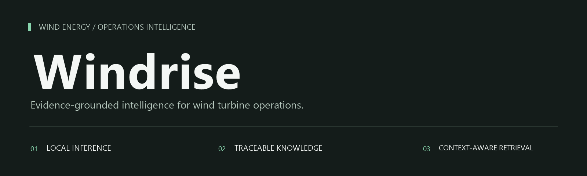
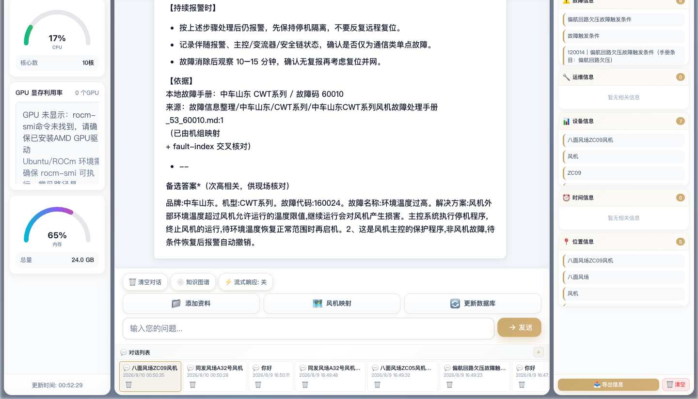
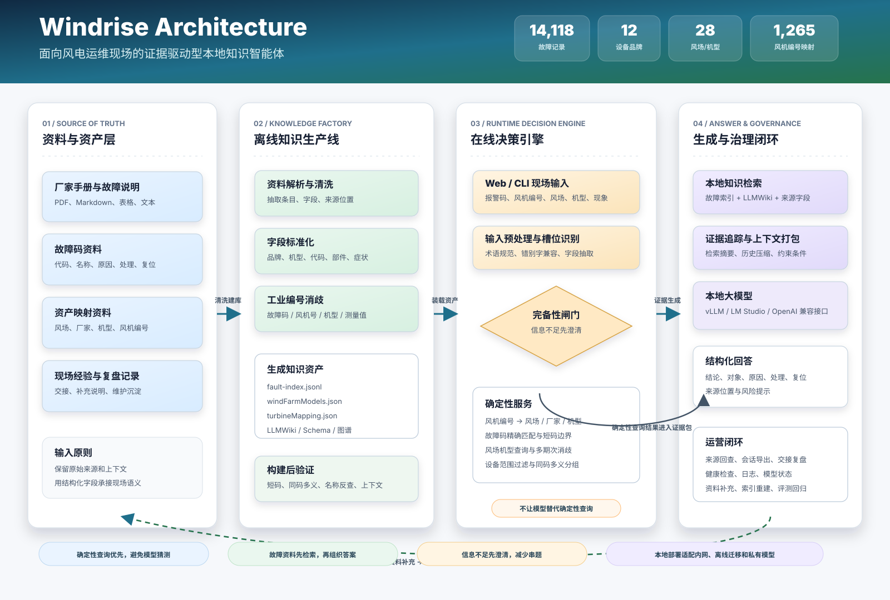

<p align="center">
  
</p>

<h1 align="center">Windrise</h1>

<p align="center">
  <strong>面向风电运维现场的本地知识智能体</strong>
</p>

<p align="center">
  把分散的故障手册、风场资产、机型映射和本地大模型，组合成一个可追溯、可部署、可持续维护的运维问答工作台。
</p>

<p align="center">
  <a href="#product">产品定位</a> ·
  <a href="#why">为什么需要它</a> ·
  <a href="#experience">界面展示</a> ·
  <a href="#capabilities">核心能力</a> ·
  <a href="#architecture">系统架构</a> ·
  <a href="#start">快速开始</a> ·
  <a href="#docs">文档</a>
</p>

<p align="center">
  
  
  
  
  
</p>

---

<a id="product"></a>

## 一句话

Windrise 是一个为风电场运维、检修、集控和知识维护团队打造的本地智能助手。它不会只让大模型凭经验回答，而是先识别用户在问什么、问题属于哪台设备、信息是否足够，再从结构化故障索引、风场/机型/风机映射和本地知识库里组织答案。

它的目标很明确：**让现场问题从“凭记忆找资料”变成“按设备范围找证据”。**

<table>
  <tr>
    <td align="center" width="25%"><h3>14,118</h3><strong>结构化故障记录</strong></td>
    <td align="center" width="25%"><h3>12</h3><strong>设备品牌</strong></td>
    <td align="center" width="25%"><h3>28</h3><strong>风场/机型配置</strong></td>
    <td align="center" width="25%"><h3>1,265</h3><strong>风机编号映射</strong></td>
  </tr>
</table>

<p align="center"><sub>数据规模来自当前仓库构建产物；资料更新或重新构建后会随之变化。</sub></p>

<a id="why"></a>

## 为什么需要它

风电运维的难点不只是“有没有答案”，而是**答案是否适用于当前风场、当前机型、当前报警语境**。

同一个故障码，可能在不同厂家或机型下对应完全不同的含义；同一个风场，可能同时运行多个期次和多种机型；同一个现场描述，也可能混入风机编号、机型数字、测量值、部件编号和真实报警码。传统全文搜索容易返回“看起来相关”的内容，但现场需要的是能核对来源、范围和处理条件的答案。

Windrise 为这个问题做了三层约束：

| 现场问题 | Windrise 的处理 | 输出结果 |
| :--- | :--- | :--- |
| “303804 是什么故障，怎么处理？” | 精确匹配故障码，保留同码多义 | 故障含义、适用品牌/机型、处理建议、来源位置 |
| “八面风场 ZC09 偏航故障” | 先把风机编号映射到风场、厂家和机型 | 基于当前对象范围检索资料 |
| “轴承温度异常怎么办？” | 判断信息不足，提示补充风场/机型/故障码 | 避免跨机型拼接现场处置建议 |
| “变桨系统工作原理是什么？” | 进入理论问答路径 | 用本地模型回答通用原理，并提示现场处置需补充设备信息 |

---

<a id="experience"></a>

## 界面展示

<p align="center">
  
</p>

Windrise 提供 Web 工作台和 CLI 两类入口：Web 适合现场问答、用户管理、知识文件维护和记录导出；CLI 适合检索、构建、评测、脚本集成和离线环境运维。

| 模块 | 面向用户 | 价值 |
| :--- | :--- | :--- |
| 问答工作台 | 运维、检修、集控 | 把报警、机组、故障现象和来源资料放在同一条回答里 |
| 资源监控 | 系统维护人员 | 查看知识库、模型服务、运行日志和环境状态 |
| 关键字段提取 | 复盘与交接人员 | 自动整理风场、机型、故障码、部件和处理线索 |
| 会话与导出 | 班组与管理人员 | 保留问题过程，便于交接班、复盘和知识沉淀 |

---

<a id="capabilities"></a>

## 核心能力

### 1. 设备范围感知

Windrise 把风场、厂家、机型、具体型号和风机编号作为检索前置条件。用户提供的信息越具体，系统越能把答案收敛到对应设备；信息不足时，它会先提示补充，而不是把不同设备资料混在一起。

### 2. 故障码精确检索

系统优先匹配结构化故障码字段，减少短码误命中。例如查询 `200` 时，不应被 `20007`、测量数值或正文里的普通数字污染。遇到同码多义时，系统会保留差异并按品牌、机型、风场或含义分组展示。

### 3. 风机编号映射

现场人员常常从“几号机”或类似 `ZC09` 的编号开始描述问题。Windrise 可以把风机编号映射到风场、厂家、机型和具体型号，再进入故障检索或知识问答。

### 4. 多轮上下文管理

系统区分“补充信息”“继续追问”“纠正上一轮”和“切换新故障”。当用户分几轮补充风场、机型、故障码或现场现象时，Windrise 会继承有效上下文；当用户切换到新设备或新故障时，它会清理不相关记忆。

### 5. 本地模型与知识库协同

Windrise 通过 OpenAI 兼容接口接入本地模型服务，例如 vLLM 或 LM Studio。结构化查询、资料检索和范围过滤由系统完成，模型负责把证据组织成可读答案。

### 6. 知识资产可维护

原始资料、结构化索引、LLMWiki 页面、风场机型表和风机编号映射分层维护。资料更新后可以重新构建索引，并通过冒烟测试和回归评测检查短码、同码多义、名称反查、上下文继承和跨风场切换。

---

<a id="architecture"></a>

## 系统架构

Windrise 的架构分成三条主线：**离线知识生产线**负责把原始资料变成可检索资产，**在线问答链路**负责把现场问题路由到正确证据，**运维治理闭环**负责监控、评测和持续更新。

<p align="center">
  
</p>

<p align="center"><sub>展示从资料治理、知识构建、在线路由、确定性查询、本地生成到运营反馈的完整链路。</sub></p>

**关键链路：**

| 链路 | 触发场景 | 系统动作 | 用户看到的结果 |
| :--- | :--- | :--- | :--- |
| 精确故障码链路 | 用户输入 `303804`、`SC03` 等明确代码 | 代码边界匹配 -> 同码多义分组 -> 设备范围过滤 -> 来源追踪 | 返回适用对象、故障含义、处理/复位字段和来源位置 |
| 风机编号链路 | 用户从 `ZC09`、`15#`、某号机开始提问 | 识别风机编号 -> 映射风场/厂家/机型 -> 再进入故障或资料检索 | 避免把机组编号误当故障码，答案自动带设备上下文 |
| 模糊现象链路 | 用户说“轴承温度异常”“偏航电机报警” | 抽取部件和症状 -> 检查是否缺风场/机型/代码 -> 必要时澄清 | 信息不足时不硬答，信息完整后按范围检索 |
| 理论问答链路 | 用户问“变桨系统原理”“齿轮箱作用” | 跳过故障库低价值搜索 -> 打包理论上下文 -> 本地模型回答 | 给出通用解释，并提示现场处置还需具体设备信息 |
| 知识维护链路 | 新增手册、表格、现场复盘记录 | 解析清洗 -> 重建索引/Wiki/映射 -> 执行冒烟和回归评测 | 知识资产可持续更新，不依赖重新训练模型 |

**设计原则：**

- 能确定性查询的，不交给模型猜。
- 需要专业资料的，先检索再回答。
- 信息不足会影响现场判断的，先澄清再检索。
- 回答必须尽量保留对象范围、来源文件和可复查线索。
- 本地部署优先，适配内网、离线迁移和私有模型环境。

---

## 适合谁

| 角色 | Windrise 帮你做什么 |
| :--- | :--- |
| 风电场运维人员 | 快速查询故障码、报警含义、处理建议和复位条件 |
| 检修工程师 | 按风场、机型、部件和症状定位更适用的资料 |
| 集控中心 | 在多风场、多机型场景下减少同码误判和串题 |
| 知识库维护人员 | 把手册、表格、故障记录构建成可检索资产 |
| 部署与系统管理员 | 在 Ubuntu、本地模型、离线包和内网环境中交付运行 |

---

<a id="start"></a>

## 快速开始

> 推荐环境：Ubuntu/Linux、Node.js 22+、npm、Python 3.10+、venv。问答功能需要可访问的 OpenAI 兼容模型服务。

### 1. 安装依赖并构建入口

```bash
PROJECT_DIR="$PWD" bash deploy/ubuntu-source/install_ubuntu.sh
```

### 2. 配置本地模型

```bash
export LMSTUDIO_BASE_URL=http://127.0.0.1:8000
export LMSTUDIO_MODEL=Qwen-30B
export VLLM_API_URL="$LMSTUDIO_BASE_URL/v1/chat/completions"
export VLLM_MODEL_NAME="$LMSTUDIO_MODEL"
```

### 3. 初始化 Web 管理账号

```bash
export INIT_ADMIN_USERNAME=admin
read -r -s -p "Initial admin password: " INIT_ADMIN_PASSWORD
echo
export INIT_ADMIN_PASSWORD
```

### 4. 启动 Web 工作台

```bash
PROJECT_DIR="$PWD" bash deploy/ubuntu-source/run_web_ubuntu.sh
```

浏览器访问：

```text
http://<服务器地址>:5002
```

### 5. 使用 CLI

```bash
bash bin/windrise-bash doctor
bash bin/windrise-bash "303804 是什么故障，怎么处理"
bash bin/windrise-bash search 偏航 电机
bash bin/windrise-bash ask
```

---

## 知识构建与验证

```bash
npm run build:knowledge
npm run build:wind-farm-models
npm run build:turbine-mapping
npm run visual:wind-graph
```

常用验证入口：

```bash
npm run smoke:wind-llmwiki
npm run eval:faults
npm run eval:windrise-retrieval
npm run audit:fault-ambiguity
```

需要可用模型服务的验证：

```bash
npm run smoke:lmstudio
npm run eval:windrise
```

---

## 部署形态

| 方式 | 适合场景 | 交付内容 |
| :--- | :--- | :--- |
| Ubuntu 源码部署 | 可安装依赖、需要维护和二次开发 | 源码、安装脚本、构建脚本、启动脚本 |
| Ubuntu Portable | Linux x86_64，使用预构建发布包 | 随包携带 Node、Python 与依赖 |
| Ubuntu 离线迁移 | 目标环境无法联网安装依赖 | 在准备环境构建后迁移、安装并验证 |

相关说明见 `deploy/ubuntu-source/README_UBUNTU_SOURCE.md`、`deploy/ubuntu-portable/README_PORTABLE.md` 和 `deploy/ubuntu-offline/README.md`。

---

<a id="docs"></a>

## 文档导航

| 文档 | 内容 |
| :--- | :--- |
| `docs/用户使用手册.md` | 问答、故障查询、条件补充、结果阅读和会话导出 |
| `docs/内部维护人员手册.md` | 用户、资料、资产映射、配置和排错 |
| `ROUTING_DESIGN.md` | 问答路由、理论问题、故障检索和澄清策略 |
| `SYSTEM_WORKFLOW_AND_USER_OPTIMIZATIONS.md` | 从知识构建到用户体验的完整系统流程 |
| `wind-llmwiki/schema.md` | LLMWiki 知识结构与字段说明 |
| `reports/` | 检索、上下文、同码多义等评测与实验产物 |

---

## 仓库结构

| 路径 | 作用 |
| :--- | :--- |
| `src/` | 终端智能体、命令、服务、上下文和工具实现 |
| `src/data/` | 风场机型配置与风机编号映射 |
| `hn/` | Flask Web 服务、页面、用户管理和运行脚本 |
| `风机故障码/` | 原始资料与结构化故障索引 |
| `wind-llmwiki/` | Wiki 页面、知识图谱和领域知识结构 |
| `scripts/` | 构建、评测、知识维护、打包和部署辅助脚本 |
| `deploy/` | Ubuntu 源码部署、Portable 包和离线迁移方案 |
| `docs/` | 用户与维护文档 |

---

## 边界说明

Windrise 面向资料检索、信息整理、运维复盘和现场判断辅助。现场操作仍应以 HMI/SCADA 原始报警、趋势数据、就地检查、安全规程和厂家正式文件为准。

本仓库包含恢复后的通用智能体源码与 Windrise 领域增强模块。使用、修改和分发前，请核对源码、资料、模型和第三方依赖的授权范围。
