# 华能吉林公司智能助手用户使用手册

适用对象：风场运行、检修、集控和值班人员。

> 使用原则：现场最终判断仍以 HMI/SCADA 原始报警、趋势量、就地检查结果和现场安全规程为准。智能助手用于辅助检索、整理和复盘，不替代现场处置流程。

## 目录

- [1. 访问系统并登录](#1.-访问系统并登录)
- [2. 熟悉首页布局](#2.-熟悉首页布局)
- [3. 发送第一个问题](#3.-发送第一个问题)
- [4. 按故障码查询](#4.-按故障码查询)
- [5. 按提示补充厂家、机型或风场](#5.-按提示补充厂家、机型或风场)
- [6. 按现象模糊查询](#6.-按现象模糊查询)
- [7. 提问知识类问题](#7.-提问知识类问题)
- [8. 查看回答中的关键字段](#8.-查看回答中的关键字段)
- [9. 下载对话记录](#9.-下载对话记录)
- [10. 使用关键信息提取器](#10.-使用关键信息提取器)
- [11. 修改密码](#11.-修改密码)
- [12. 安全类问题的处理原则](#12.-安全类问题的处理原则)
- [13. 常见使用建议](#13.-常见使用建议)

## 1. 访问系统并登录

1. 在浏览器打开系统地址：

   ```text
   http://服务器IP:5002
   ```

2. 输入分配的账号和密码。通常账号为工号，初始密码也为工号。
3. 点击“登录”进入系统。

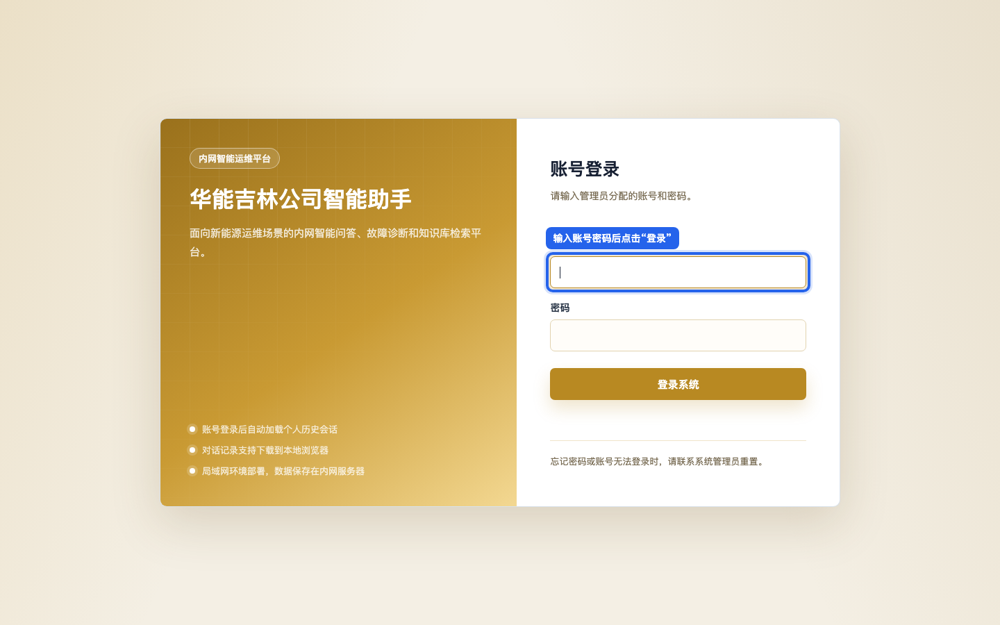

## 2. 熟悉首页布局

登录后首页主要分为四个区域：

1. 顶部栏：显示系统名称、当前用户、“修改密码”和“退出”。
2. 对话区：查看用户提问和 AI 回复。
3. 输入区：输入问题、发送问题、清空对话、打开知识图谱、切换流式响应。
4. 关键信息提取器：从当前对话中提取故障、设备、时间、位置和运维信息。

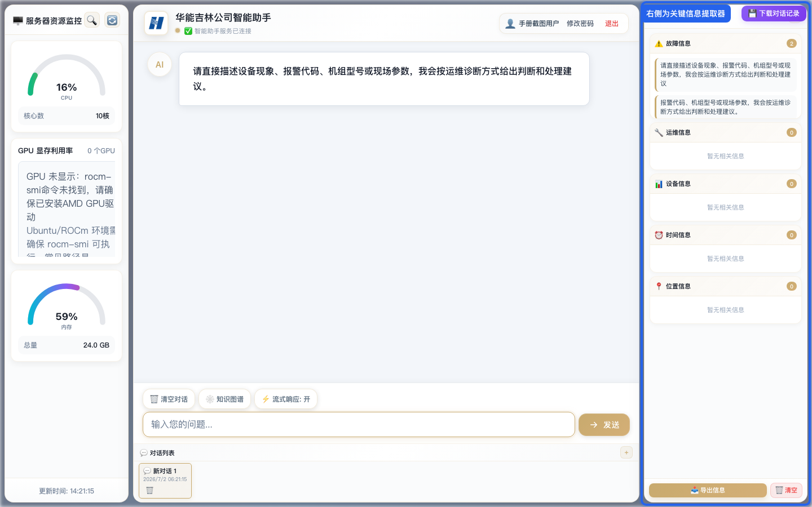

## 3. 发送第一个问题

1. 在底部输入框输入问题。
2. 确认问题内容完整。
3. 点击“发送”，或按回车键发送。

示例：

```text
故障码60001
```

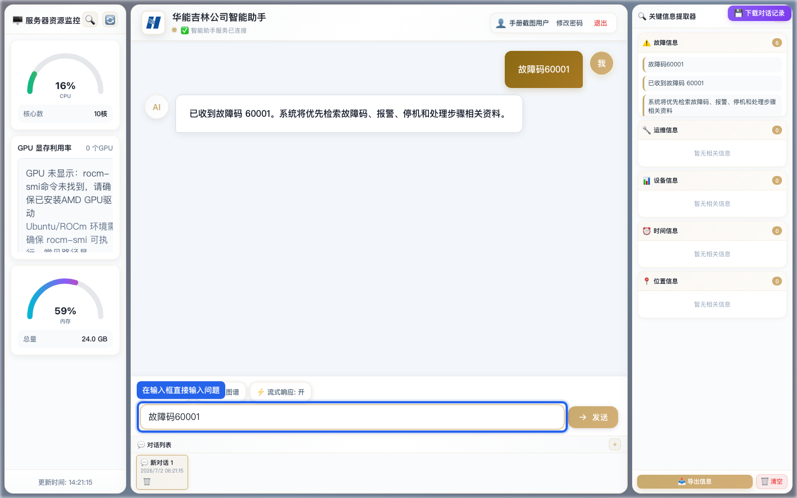

## 4. 按故障码查询

如果现场有 HMI/SCADA 原始报码，优先直接输入完整报码。

示例：

```text
故障码为60001
报码303804怎么处理
```

系统会优先检索故障码、报警、停机、处理步骤等资料，并在回答中展示厂家、机型、故障名称、处理方向和来源文件等信息。

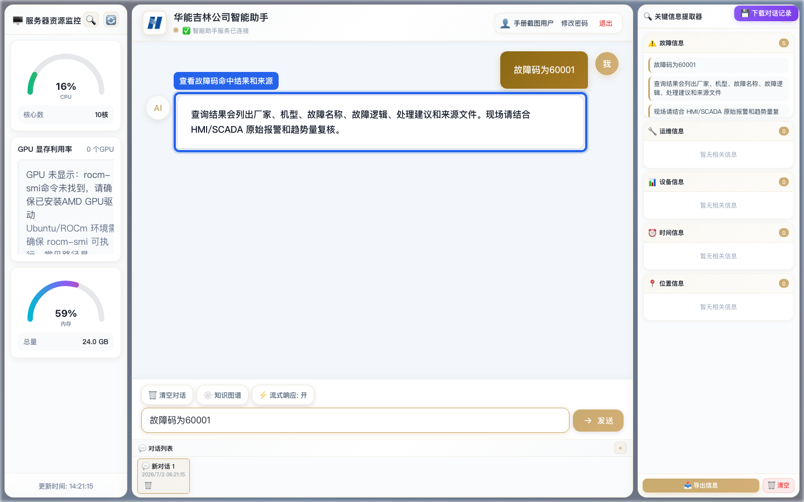

## 5. 按提示补充厂家、机型或风场

如果同一个报码在多个厂家或机型里都有，系统会提示补充条件。此时不要重新开新问题，直接在当前对话中继续补充即可。

可补充的信息包括：

- 厂家
- 机型
- 风场
- 具体型号
- HMI/SCADA 原始告警全称

示例：

```text
厂家华锐，机型SL1500-ABB
风场八面，机型CWT系列
具体型号CWT4200-D175
```

补充后系统会按这些条件收敛结果。

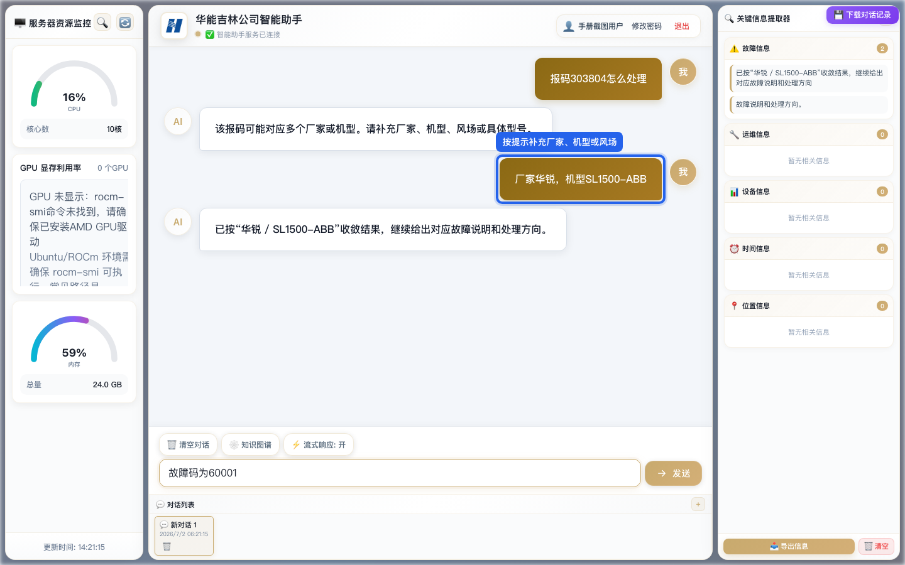

## 6. 按现象模糊查询

没有报码时，可以描述部件和现象。系统会先给少量高相关候选，不会一次展开大量故障码。

示例：

```text
变频器散热片限功率
发电机底部振动传感器触发
叶轮转速突变或超过限制值
齿轮箱油压低停机
```

如果结果太多，继续补充厂家、机型、风场或 HMI/SCADA 原始报码。

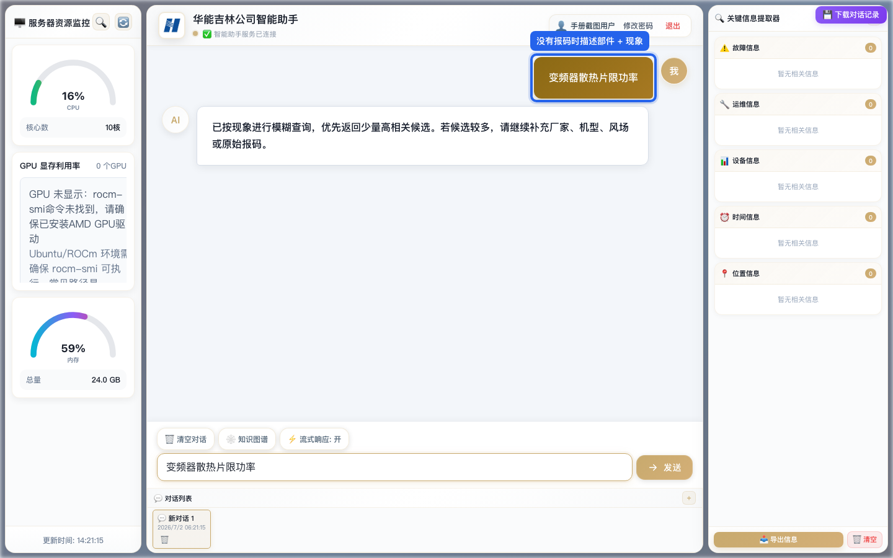

## 7. 提问知识类问题

如果只是问原理、影响、危害、通用原因，不需要先补充厂家和机型，系统会直接用大模型回答。

示例：

```text
叶片结冰会引发什么故障
变流器为什么会报过压
液压站压力上不来一般有哪些方向
```

注意：这类回答是通用运维知识，不等同于某个厂家专用故障码结论。

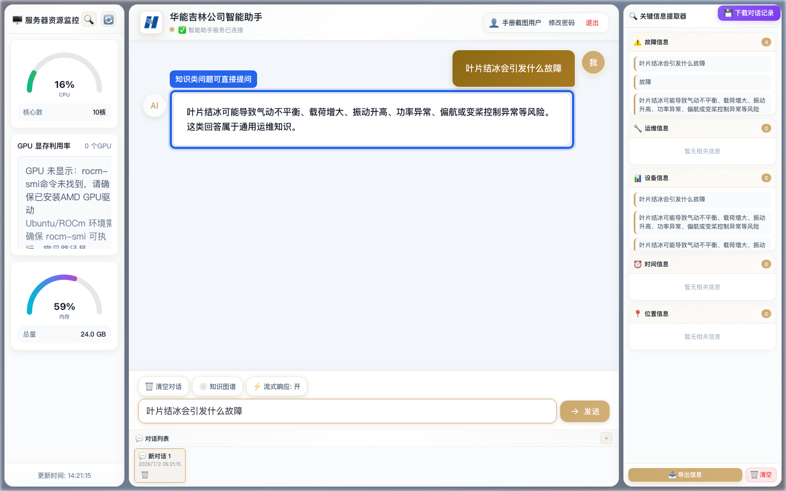

## 8. 查看回答中的关键字段

回答中常见字段含义如下：

- 厂家：资料对应的设备厂家。
- 机型：资料对应的系列机型。
- 具体型号：场站映射表中的具体型号。
- 风场：当前资料或映射覆盖的风场。
- 风机编号：场站-型号映射表中维护的对应编号。
- 来源：系统命中的本地资料文件。

查看结果时，重点核对厂家、机型、风场、来源是否与现场一致。

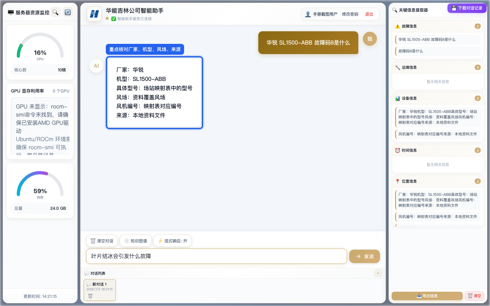

## 9. 下载对话记录

页面右上角有“下载对话记录”按钮，可导出当前对话，适合用于班组交接、故障复盘或工单附件。

操作步骤：

1. 至少完成一轮完整问答。
2. 点击右上角“下载对话记录”。
3. 浏览器会下载 Markdown 文件。
4. 下载完成后，可将文件作为交接、复盘或工单附件保存。

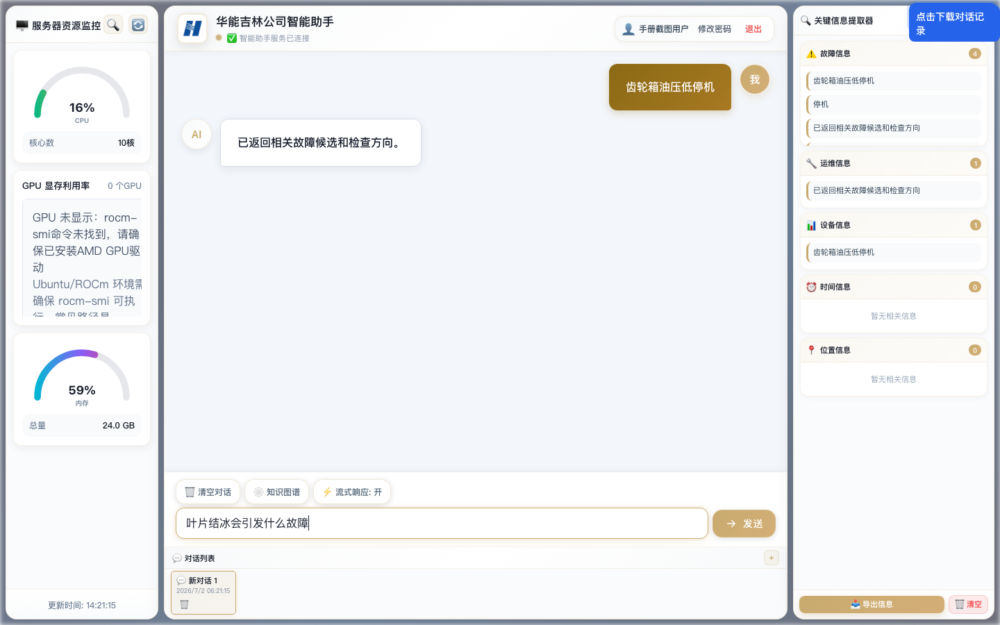

## 10. 使用关键信息提取器

右侧“关键信息提取器”可从当前对话中整理：

- 故障信息
- 运维信息
- 设备信息
- 时间信息
- 位置信息

操作步骤：

1. 完成相关对话。
2. 点击右侧“提取信息”。
3. 检查提取结果是否完整。
4. 点击“导出信息”生成 Markdown 文件。

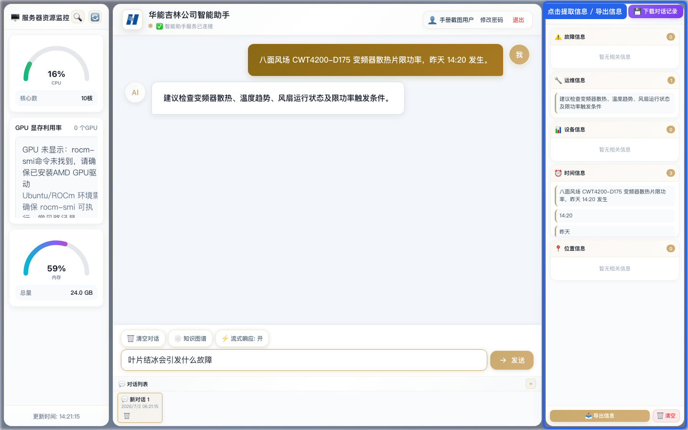

## 11. 修改密码

首次登录后建议修改初始密码。

操作步骤：

1. 点击页面右上角“修改密码”。
2. 输入当前密码。
3. 输入新密码。
4. 再次输入新密码确认。
5. 提交后使用新密码重新登录。

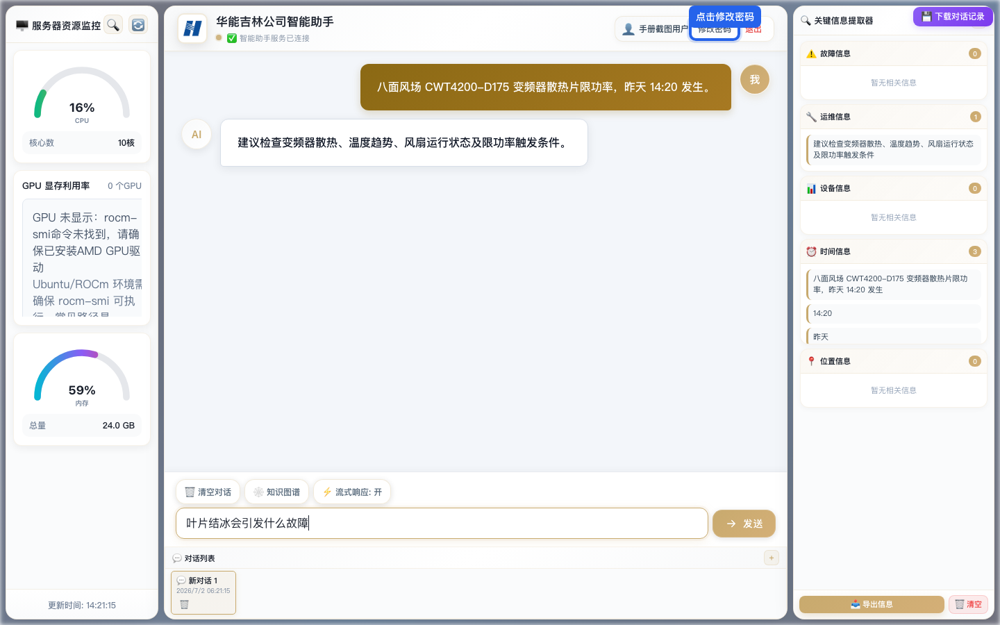

## 12. 安全类问题的处理原则

涉及以下情况时，先按现场安全规程处理，不要依赖智能助手反复尝试复位：

- 安全链动作
- 超速
- 严重振动
- 冒烟或异味
- 过温
- 明显机械、电气异常

智能助手可以帮助查询资料和整理处置方向，但现场风险控制优先级最高。

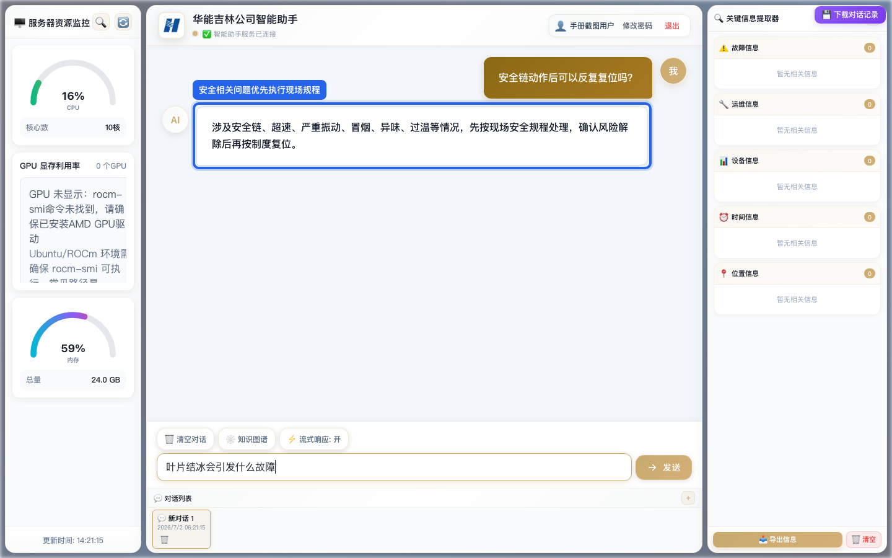

## 13. 常见使用建议

- 有报码时，先输入完整报码，不要只输入一部分。
- 没有报码时，尽量描述部件和现象，例如“变频器散热片限功率”。
- 如果系统提示补充条件，优先补厂家、机型、风场、具体型号。
- 如果结果和现场不一致，继续补充原始告警全称、伴随报警和趋势量。
- 下载对话记录和导出关键信息前，先检查当前对话是否包含完整上下文。
- 涉及安全风险时，先执行现场规程，再使用系统辅助查询。
